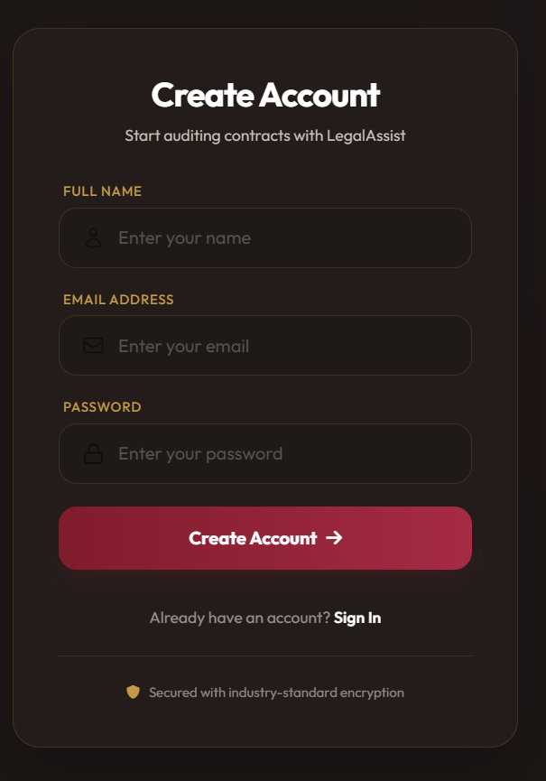
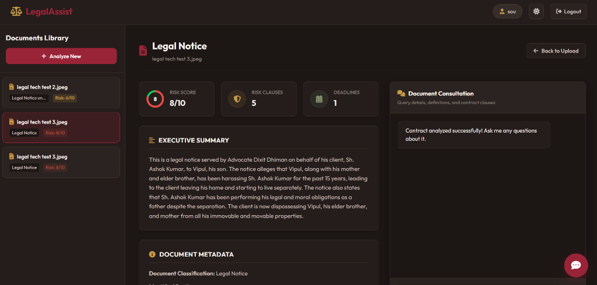
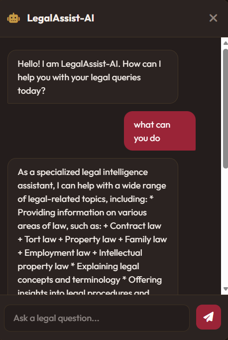

# ⚖️ LegalAssist — Premium Contract Audit & Legal Intelligence

LegalAssist is a unified, enterprise-grade MERN platform designed for startups, freelancers, and small businesses to audit legal contracts, detect potential liabilities, identify critical deadlines, and consult with a specialized AI legal assistant. 

Unlike typical glowing neon "AI" tools, LegalAssist is crafted with a **sophisticated, warm editorial aesthetic** (royal burgundy, warning gold, warm ivory, and deep charcoal) that reflects the trust, security, and precision of a traditional digital law office.

🚀 **Live Deployment URL**: **[https://legal-assist-ai-ten.vercel.app](https://legal-assist-ai-ten.vercel.app)**

---

## 📸 Product Screenshots

### 1. User Authentication (Signup)
A clean, minimalist authentication page styled in warm ivory, deep espresso, and a burgundy action button to welcome users to the platform.


### 2. Main Compliance & Auditing Dashboard
Features a persistent left-hand documents library panel to toggle between previously audited contracts, displaying critical metrics, obligations, metadata, and an animated red-green circular risk score.


### 3. Integrated Legal Consultation Chatbot
Ask follow-up questions, request definitions, or audit specific clauses inside the contract with a context-aware legal assistant.


---

## 🎨 Premium Visual & UI Redesign
- **Isolated Branding Palette**: Deep Royal Burgundy (`#801C2B`), Warning Bronze/Gold (`#C49A45`), Warm Ivory Cream (`#FAF8F5`/`#FAF7F2`), and Deep Espresso Charcoal (`#1C1615`).
- **Interactive Risk Pie Chart**: A red-green SVG circular chart representing the risk score (e.g., 8/10 fills 80% of the circle in red, leaving 20% in green) with a smooth clockwise drawing animation on load.
- **Documents Library Sidebar**: A left-hand navigation panel that persistently pulls your document list directly from MongoDB. Instantly toggle between agreements to review compliance reports and resume consultation chats.
- **Floating consultation Chatbot**: A general legal query assistant in the bottom right corner, fully matched to the burgundy/cream palette.

---

## ⚡ Technical consolidation (MERN Stack)
Consolidated the system from a multi-server framework (FastAPI + Node.js) into a **single Node.js Express backend**, simplifying local setups and cloud deployments.
- **Persistent Storage**: All contracts, extracted text, metadata, parsed risk matrices, and chat histories are saved securely in your MongoDB cluster.
- **PDF & DOCX Extraction**: Built-in parsing using ESM-friendly `pdf-parse` and `mammoth` directly in the Express server.
- **multimodal OCR Vision**: Converts contract photo uploads (JPG, JPEG, PNG) to base64 and transcribes them using Groq's vision model (`meta-llama/llama-4-scout-17b-16e-instruct`).
- **Advanced LLM Reasoning**: Performs deep legal audits and maintains chat history using `llama-3.3-70b-versatile` via Groq.

---

## 📂 Project Architecture

```
legal-assist-ai/
├── assets/                   # README Product Screenshots
├── mern-auth/
│   ├── server/               # Express.js Backend (Port 5000)
│   │   ├── config/           # Database & Mail configuration
│   │   ├── controllers/      # Auth, User, and Contract Controllers
│   │   ├── models/           # Mongoose Schemas (User & Contract)
│   │   ├── routes/           # REST Endpoints
│   │   └── server.js         # Entry Point
│   │
│   └── client/               # React Vite Frontend (Port 5173)
│       ├── src/
│       │   ├── api/          # Axios Configurations
│       │   ├── components/   # Header, Navbar, and Floating Chatbot
│       │   ├── pages/        # Login, Reset Password, and LegalTech Dashboard
│       │   ├── styles/       # Isolated CSS Stylesheets
│       │   └── main.jsx
│       └── postcss.config.js # Isolated PostCSS configuration
```

---

## ⚙️ Local Installation & Setup

### Prerequisites
- Node.js (v18+)
- MongoDB Atlas cluster account (or local MongoDB running)
- Groq Cloud API Key

### Step 1: Configure Environment Variables
Create a `.env` file in `mern-auth/server/` directory:
```env
MONGODB_URI=your_mongodb_atlas_connection_string
GROQ_API_KEY=your_groq_api_key
JWT_SECRET=your_jwt_signing_secret
PORT=5000
CLIENT_URL=http://localhost:5173
```

### Step 2: Install Dependencies & Run

#### Start Backend Server (Terminal 1)
```bash
cd mern-auth/server
npm install
npm run dev
```
*Expected console output: `✅ MongoDB Connected Successfully` and `Server is running on Port: 5000`*

#### Start Frontend Client (Terminal 2)
```bash
cd mern-auth/client
npm install
npm run dev
```
*Expected console output: `➜  Local:   http://localhost:5173/`*

---

## 🛡️ Security & Privacy
- **JWT Authentication**: Secure user session tokens stored in HTTP-Only cookies.
- **Password Hashing**: Salts and hashes passwords via `bcryptjs`.
- **CORS Protection**: Access control headers restricted to authorized dev and staging origins.
- **Isolated Environments**: PostCSS configuration isolated locally to avoid parent directory dependency conflicts.
